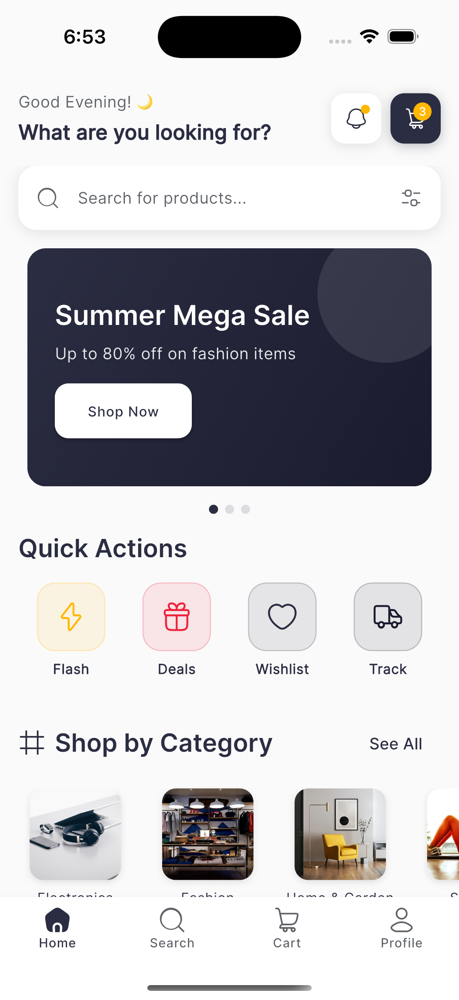
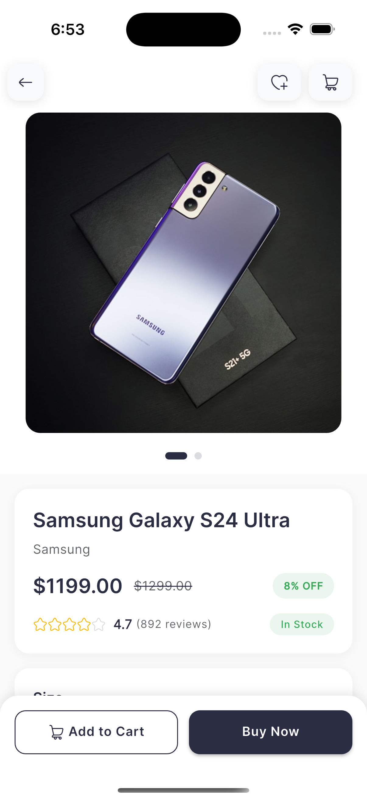
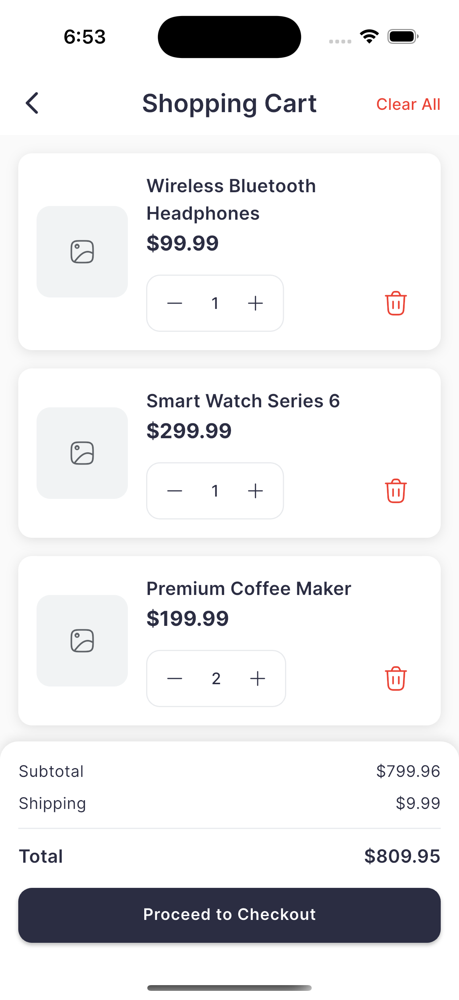
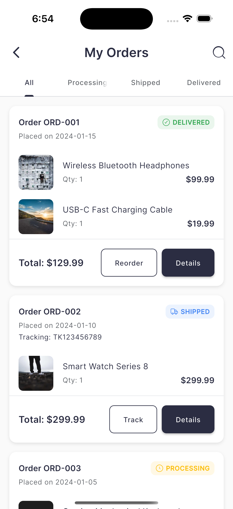
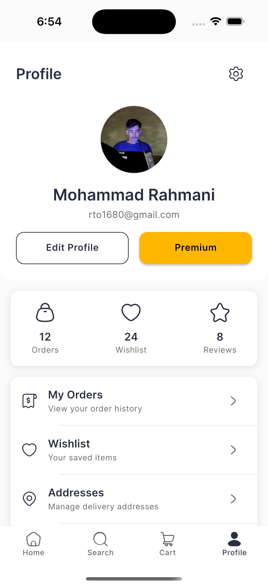
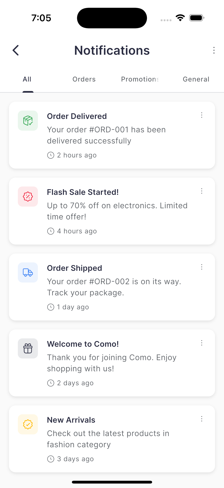
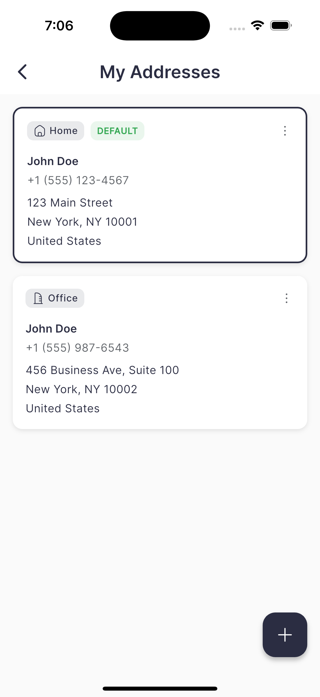
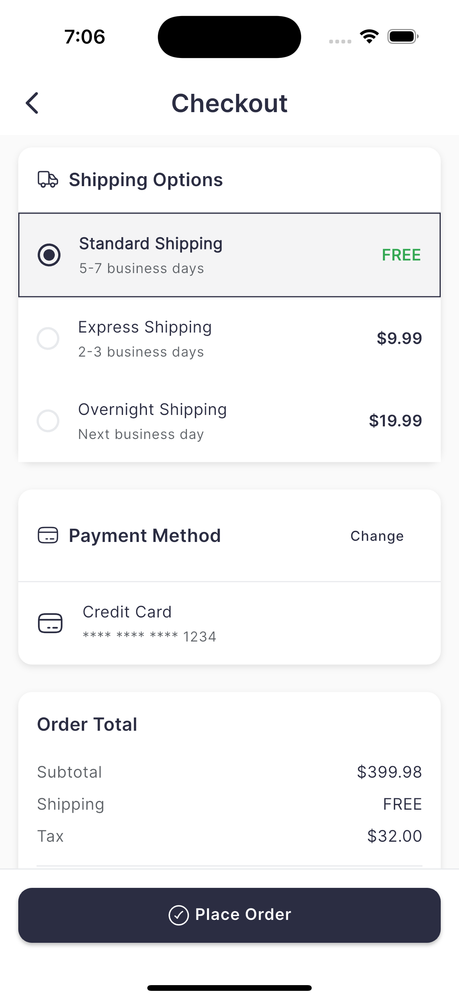

<div align="center">
  <h1>🛍️ Como - Ecommerce UI Kit</h1>
  <p><strong>A beautiful, modern, and comprehensive Flutter ecommerce UI kit</strong></p>
  
  [](https://flutter.dev)
  [](LICENSE)
  [](CONTRIBUTING.md)
  
</div>

---

## 📱 Screenshots

<div align="center">
  
  
  
  
</div>

<div align="center">
  
  
  
  
</div>

---

## ✨ Features

### 🎨 **Modern & Minimal Design**
- Clean and intuitive user interface
- Carefully crafted color scheme and typography
- Smooth animations and transitions
- Responsive layout for all screen sizes

### 📦 **Complete Ecommerce Screens**
- **Authentication**: Login, Register
- **Home**: Featured products, categories, banners
- **Products**: Product listing, details, search, filters
- **Shopping**: Cart, checkout, payment methods
- **Orders**: Order history, tracking, reviews
- **User**: Profile, wishlist, addresses, settings
- **Additional**: Notifications, help & support, legal pages

### 🛠️ **Well-Structured Codebase**
- Feature-based architecture
- Reusable components and widgets
- Clean and maintainable code
- Type-safe with null safety
- Comprehensive constants and styling system

### 🎯 **Pre-built Components**
- Custom buttons with multiple variants
- Styled text fields with validation
- Product cards (vertical & horizontal layouts)
- Category cards
- Loading states and shimmer effects
- Error handling views

---

## 🚀 Getting Started

### Prerequisites

- Flutter SDK: `>=3.9.0`
- Dart SDK: `>=3.0.0`
- iOS Simulator / Android Emulator / Physical Device

### Installation

1. **Clone the repository**
   ```bash
   git clone https://github.com/afgprogrammer/Flutter-tech-commerce-ui-kit.git
   cd como
   ```

2. **Install dependencies**
   ```bash
   flutter pub get
   ```

3. **Run the app**
   ```bash
   flutter run
   ```

---

## 📦 Dependencies

This project uses the following key dependencies:

| Package | Purpose |
|---------|---------|
| [go_router](https://pub.dev/packages/go_router) | Navigation and routing |
| [cached_network_image](https://pub.dev/packages/cached_network_image) | Image caching |
| [carousel_slider](https://pub.dev/packages/carousel_slider) | Product carousels |
| [google_fonts](https://pub.dev/packages/google_fonts) | Custom typography |
| [hugeicons](https://pub.dev/packages/hugeicons) | Beautiful icon set |
| [shimmer](https://pub.dev/packages/shimmer) | Loading animations |
| [flutter_svg](https://pub.dev/packages/flutter_svg) | SVG support |
| [flutter_rating_bar](https://pub.dev/packages/flutter_rating_bar) | Product ratings |
| [badges](https://pub.dev/packages/badges) | Cart badges |
| [flutter_staggered_grid_view](https://pub.dev/packages/flutter_staggered_grid_view) | Grid layouts |
| [animations](https://pub.dev/packages/animations) | Page transitions |

---

## 📂 Project Structure

```
lib/
├── core/
│   ├── constants/          # App-wide constants
│   │   ├── app_colors.dart
│   │   ├── app_constants.dart
│   │   └── app_text_styles.dart
│   ├── theme/             # Theme configuration
│   │   └── app_theme.dart
│   └── utils/             # Utility functions
├── features/              # Feature modules
│   ├── auth/             # Authentication screens
│   ├── home/             # Home screen
│   ├── product/          # Product screens
│   ├── cart/             # Shopping cart
│   ├── checkout/         # Checkout flow
│   ├── order/            # Order management
│   ├── profile/          # User profile
│   ├── wishlist/         # Wishlist
│   ├── search/           # Search functionality
│   ├── categories/       # Category browsing
│   ├── notifications/    # Notifications
│   ├── settings/         # App settings
│   ├── payment/          # Payment methods
│   ├── address/          # Address management
│   ├── reviews/          # Product reviews
│   ├── help/             # Help & support
│   ├── security/         # Security settings
│   └── legal/            # Legal pages
├── models/               # Data models
│   └── product.dart
├── services/             # Business logic
│   ├── cart_service.dart
│   └── product_service.dart
├── shared/               # Shared widgets
│   └── widgets/
│       ├── como_button.dart
│       ├── como_text_field.dart
│       └── product_card.dart
└── main.dart             # App entry point
```

---

## 🎨 Design System

### Colors
The app uses a carefully selected color palette defined in `app_colors.dart`:
- **Primary**: Main brand color
- **Secondary**: Accent color
- **Success**: For positive actions
- **Error**: For warnings and errors
- **Background**: App background color
- **Text**: Primary and secondary text colors

### Typography
Custom text styles are defined in `app_text_styles.dart`:
- Headlines (Large, Medium, Small)
- Body text (Large, Medium, Small)
- Labels and captions
- Product-specific styles

### Spacing & Layout
Consistent spacing system in `app_constants.dart`:
- Padding values (XS, S, M, L, XL)
- Border radius values
- Icon sizes
- Common dimensions

---

## 🔧 Customization

### Changing Colors
Edit the color constants in `lib/core/constants/app_colors.dart`:

```dart
class AppColors {
  static const Color primary = Color(0xFF2C3E50);
  static const Color secondary = Color(0xFF3498DB);
  // ... customize other colors
}
```

### Changing Fonts
Modify the font family in `lib/core/constants/app_text_styles.dart` or use different Google Fonts.

### Adding New Screens
1. Create a new feature folder in `lib/features/`
2. Add your screen widgets
3. Update navigation in `main.dart` or router configuration

---

## 🛠️ Available Screens

### ✅ Authentication
- [x] Login Screen
- [x] Registration Screen

### ✅ Shopping
- [x] Home Screen with categories and featured products
- [x] Product Listing
- [x] Product Details
- [x] Search Screen
- [x] Categories Screen
- [x] Shopping Cart
- [x] Checkout
- [x] Payment Methods

### ✅ User Management
- [x] Profile Screen
- [x] Wishlist
- [x] Order History
- [x] Order Tracking
- [x] Address Management
- [x] Settings
- [x] Change Password
- [x] Two-Factor Authentication

### ✅ Additional
- [x] Onboarding
- [x] Notifications
- [x] Product Reviews
- [x] Help & Support
- [x] Privacy Policy
- [x] Terms of Service
- [x] Licenses

---

## 📱 Screens Demo

The project includes an `all_screens_demo.dart` file that showcases all available screens in one place for easy navigation and testing.

---

## 🤝 Contributing

Contributions are welcome! Here's how you can help:

1. Fork the repository
2. Create a new branch (`git checkout -b feature/amazing-feature`)
3. Make your changes
4. Commit your changes (`git commit -m 'Add some amazing feature'`)
5. Push to the branch (`git push origin feature/amazing-feature`)
6. Open a Pull Request

Please read [CONTRIBUTING.md](CONTRIBUTING.md) for details on our code of conduct and the process for submitting pull requests.

---

## 🐛 Bug Reports & Feature Requests

If you encounter any bugs or have feature requests, please [create an issue](https://github.com/afgprogrammer/como/issues) on GitHub.

---

## 📝 License

This project is licensed under the MIT License - see the [LICENSE](LICENSE) file for details.

---

## 💖 Support

If you like this project, please consider:
- ⭐ Starring the repository
- 🍴 Forking it
- 📢 Sharing it with others
- 💬 Providing feedback

---

## 👨‍💻 Author

**Mohammad** - [@afgprogrammer](https://github.com/afgprogrammer)

---

## 🙏 Acknowledgments

- [Flutter](https://flutter.dev) - UI toolkit
- [HugeIcons](https://hugeicons.com) - Beautiful icon set
- [Unsplash](https://unsplash.com) - Sample product images
- Community contributors and supporters

---

<div align="center">
  <p>Made with ❤️ by The Flutter Lover</p>
  <p>If this project helped you, please give it a ⭐</p>
</div>
